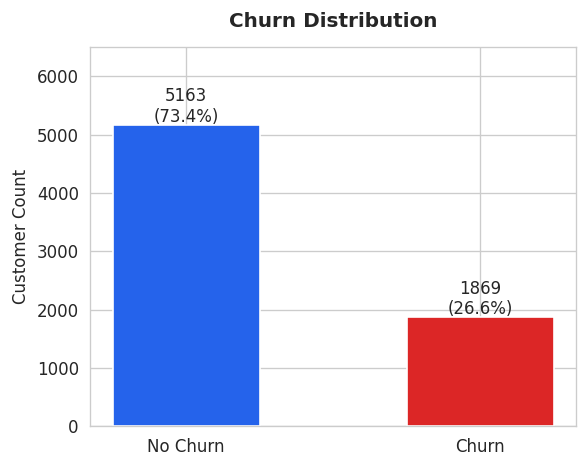
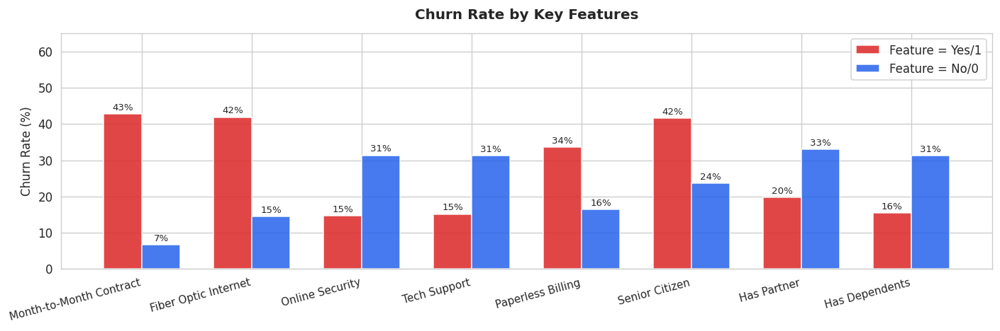
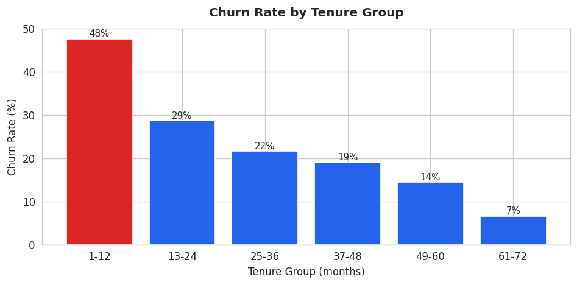

# Telco Customer Churn Prediction

## Business Problem / Motivation

Customer churn is a major challenge in the telecom industry because it directly impacts long-term revenue. Companies rely on recurring payments, so when customers leave, it creates a continuous loss that is more expensive to recover from than preventing in the first place.

The goal of this project is to predict which customers are at risk of churning so that the company can take proactive action, such as targeted retention offers or improved customer support.

From a business perspective, solving this problem allows companies to shift from reactive strategies to data-driven decision-making, helping reduce costs and improve customer retention.

From a data science perspective, this project demonstrates how machine learning can be used to turn historical customer data into actionable insights. Instead of simply analyzing past behavior, the model provides forward-looking predictions that can support real-world decisions.

Overall, this project connects technical modeling with real business impact by transforming customer data into a practical tool for predicting and reducing churn.

---

## Project Overview

This project develops a machine learning solution to predict customer churn using demographic, service usage, and billing data.

The workflow includes:
- Data cleaning and preprocessing  
- Exploratory data analysis (EDA)  
- Model training and evaluation  
- Model interpretation using SHAP  
- Deployment as an interactive Streamlit application  

Final Model Performance:
- Model: XGBoost  
- ROC-AUC: ~0.82  
- F1 Score (churn): ~0.62  
- Recall: ~0.79  
- Optimized threshold: 0.43  

The final model is deployed into an interactive application that allows users to input customer information and receive real-time churn predictions. This demonstrates not just model accuracy, but real-world usability.

---

## Data

Dataset Source:
- Kaggle: Telco Customer Churn Dataset  
  https://www.kaggle.com/datasets/blastchar/telco-customer-churn  

This dataset was originally provided by IBM and is widely used for churn prediction tasks.

Key Characteristics:
- ~7,000 customer records  
- 21 features + 1 target variable (Churn)  
- Binary classification problem (Yes/No)  
- Imbalanced dataset (~26.5% churn rate)  

Feature Categories:
- Demographics: gender, senior citizen, partner, dependents  
- Account information: tenure, contract type, payment method  
- Services: phone, internet, tech support, streaming  
- Billing: monthly charges, total charges  

Each row represents a customer, and the target variable indicates whether the customer left the company within the last month. :contentReference[oaicite:0]{index=0}

---
## Data Preprocessing

To prepare the dataset for modeling, several cleaning and transformation steps were applied.

### Cleaning
- Converted `TotalCharges` to numeric, revealing 11 missing values  
- These corresponded to customers with zero tenure, so they were removed (~0.16% of data)  
- Dropped `customerID` as it has no predictive value  

### Missing Values
- Removed rows with missing `TotalCharges`  
- No additional imputation was needed  

### Encoding
- Simplified categories like `'No internet service'` → `'No'`  
- Binary variables encoded as 0/1  
- Multi-class features one-hot encoded  
- Target (`Churn`) converted to binary (1/0)  

### Scaling
- Applied StandardScaler (fit on training data only to avoid leakage)  

### Class Imbalance
- Dataset is imbalanced (~26.5% churn)  
- Used SMOTEENN on training data only  

### Train-Test Split
- 80/20 split with stratification to preserve churn distribution

---
## Exploratory Data Analysis (EDA)

Exploratory data analysis was conducted to identify patterns and key factors influencing customer churn.

### Churn Distribution

- The dataset is imbalanced, with about 26.5% of customers churning  
- This confirms the need for imbalance handling techniques during modeling  

### Churn Rate by Key Features

- Certain features, such as contract type, internet service, and payment method, show clear differences in churn rates  
- Customers with month-to-month contracts and electronic payments tend to churn more  
- This highlights the importance of service and billing-related features  

### Tenure Group vs Churn

- Customers with shorter tenure are much more likely to churn  
- Longer-tenure customers are more stable and less likely to leave  
- This suggests customer loyalty increases over time  

### Key Insights
- Short-term customers are at the highest risk of churn  
- Contract type and payment behavior strongly influence churn  
- Class imbalance must be handled carefully for accurate predictions  
